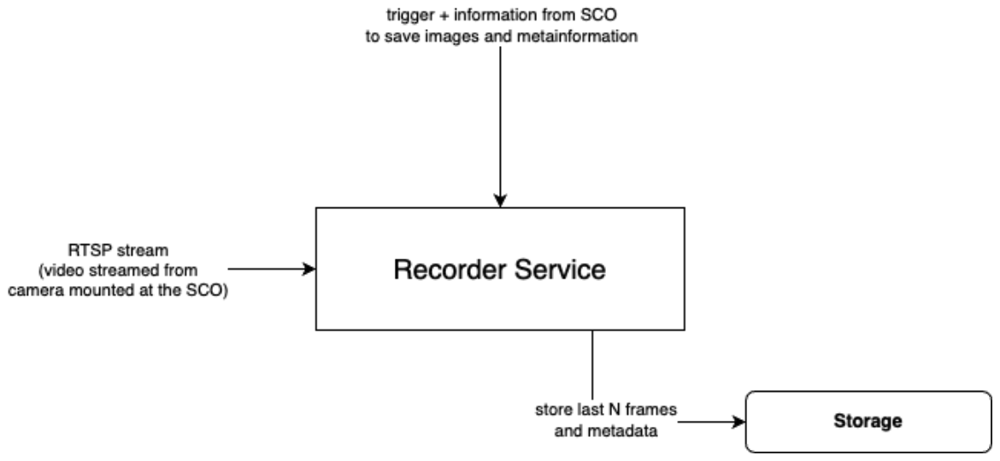

# Recorder Service
This is a simple service that receives http requests from a self-checkout cashier system and captures the last n frames from the self-checkout camera.
The captured frames are then stored in a persistent storage. At the moment the service only supports a local video source and local filesystem storage.


## Installation
The project can be installed using [poetry](https://python-poetry.org/):
```bash
poetry install
```
Alternatively, you can install the project using pip:
```bash
pip install -r requirements.txt
```
Or you can use the provided Dockerfile to build a docker image:
```bash
docker build -t recorder-service .
```

## Usage
The service can be started using the following command (requires poetry):
```bash
make run
```
It is possible to specify the number of frames to capture, the input video source and the output storage directory using the following command:
```bash
NUM_FRAMES_TO_CAPTURE='10' LOCAL_VIDEO='data/test_video.mp4' STORAGE_DIR='data/storage' make run
```
A swagger UI will be available at http://localhost:8080/ where you can test the service.

## Run Docker Image
The latest version of the service is available on the GitHub Container Registry. You can run the service using the following command:
```bash
docker run -p 8080:8080 ghcr.io/jnkielmann/recorder-service:latest
```
To use a local video source and persistent storage, you can use the following command:
```bash
docker run -p 8080:8080 -e LOCAL_VIDEO='/app/data/my_video.mp4' -v "$(pwd)/data:/app/data" -v "$(pwd)/storage:/app/storage" ghcr.io/jnkielmann/recorder-service:latest
```

## Development
Run the formater and linter:
```bash
make format
make lint
```
Run the tests:
```bash
make test
```